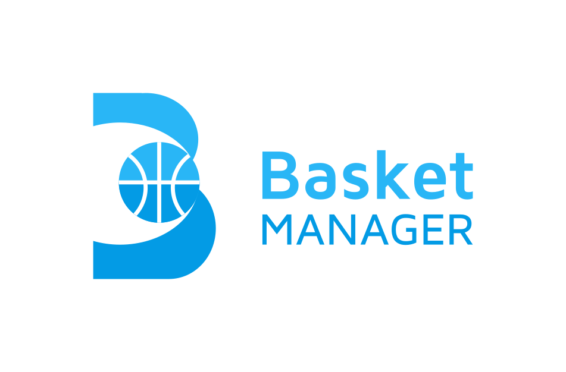
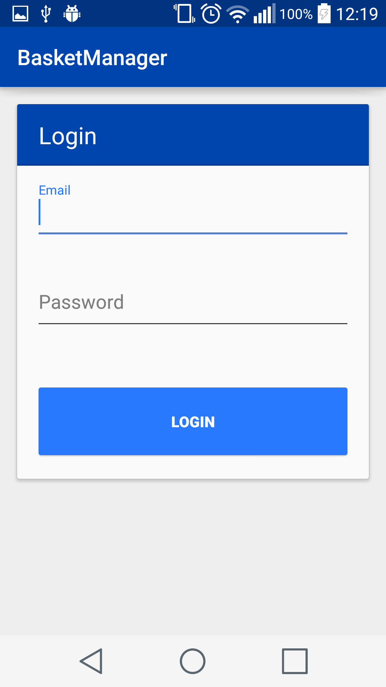
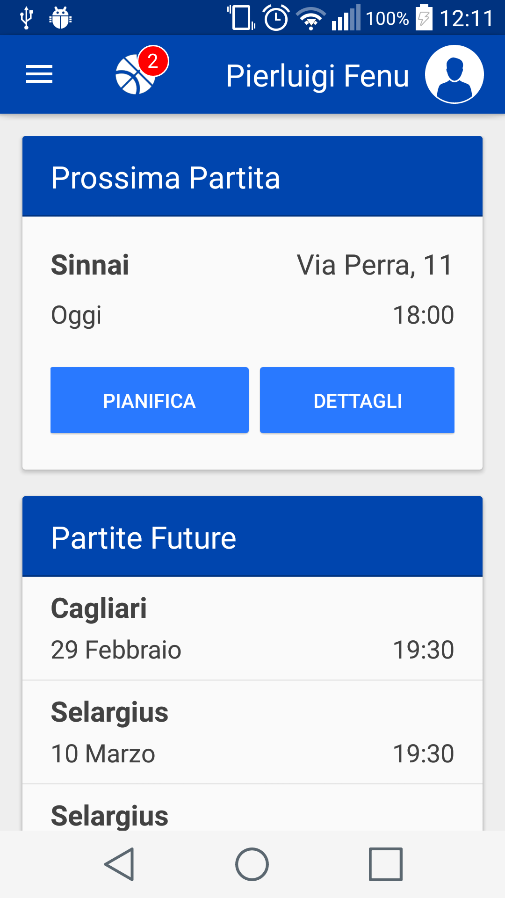
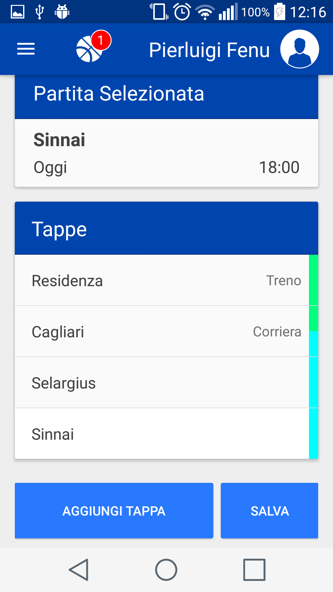
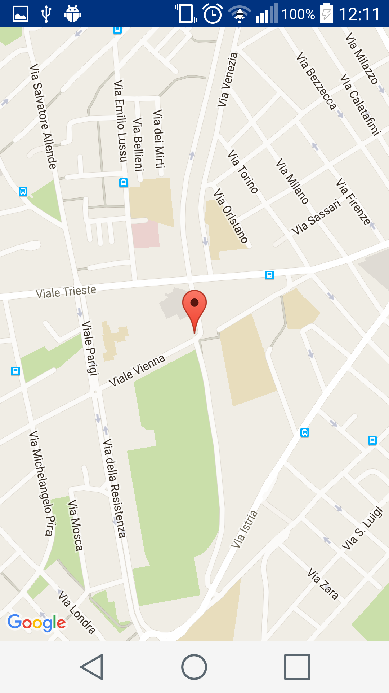
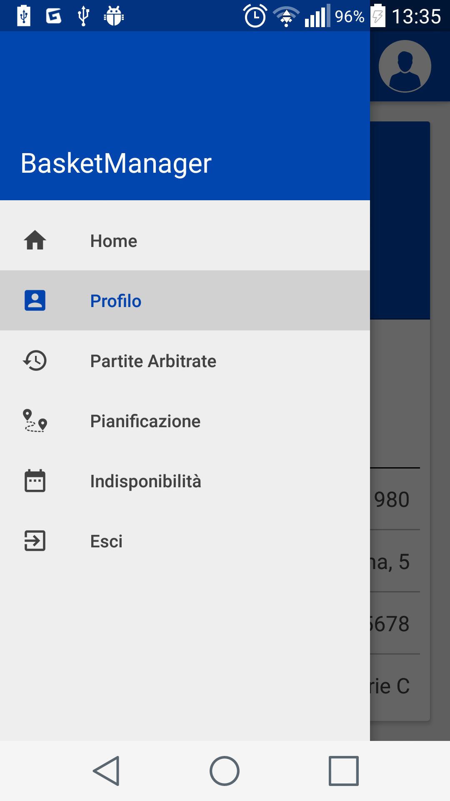
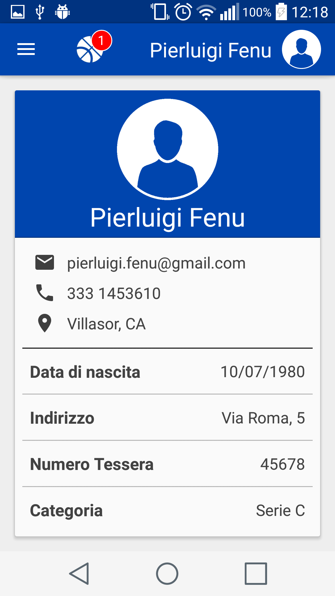
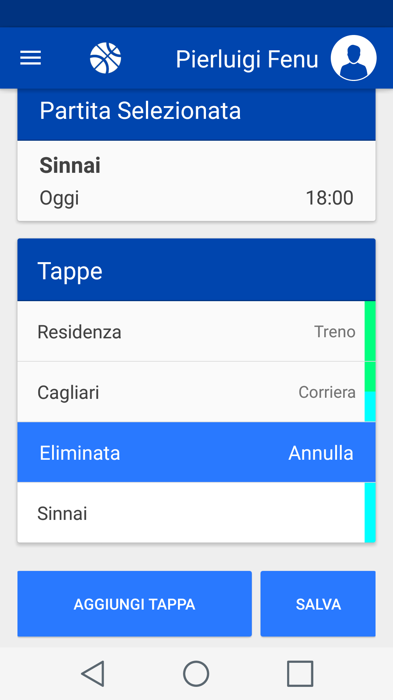
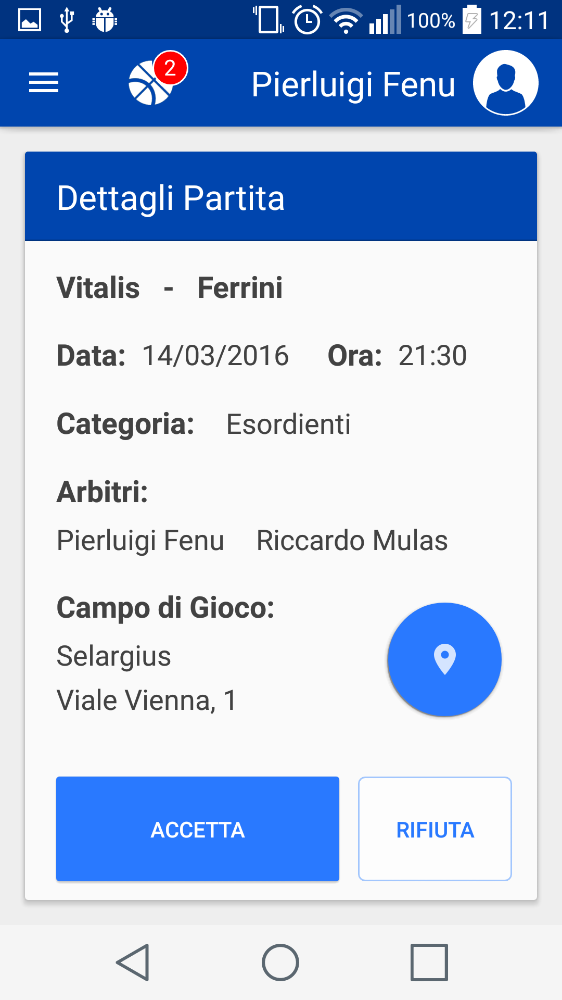
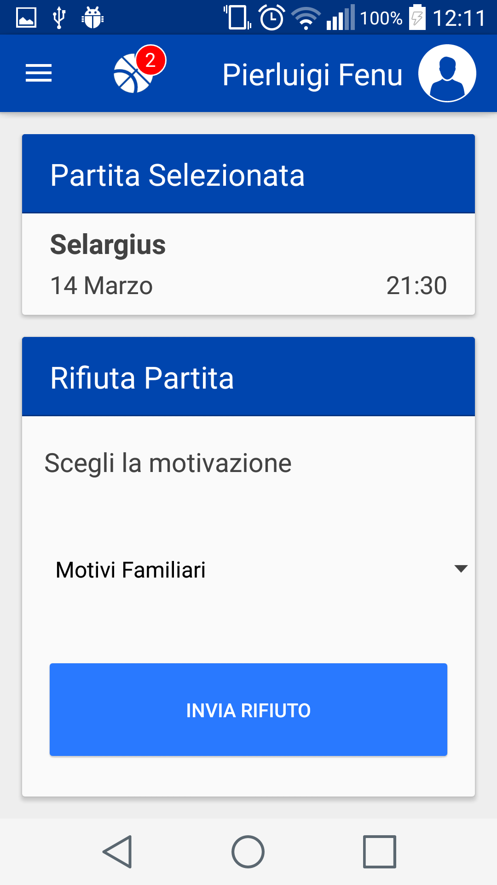

<h1 align=center>

</h1>

BasketManager is an Android application designed to allow Basket referees to manage their matches.

More in details, the application allows a referee to:

* Accept or reject an invitation to umpire a game;
* Receive a notification when a new invitation is pending;
* Manage his personal account;
* See the details of a past or upcoming match;
* Browse a map showing where the game takes place;
* Plan the way to the match, in order to ask for a refund for travel expenses.

BasketManager is built with Gradle and has been natively developed with **Android Studio** in Java 8.0.
The notification service is powered by **Microsoft Azure**, whereas the local database is managed with **SQLite**.

## Screenshots

 |  | 
------------------------|-------------------------|------------------------
 |  | 
 |  | 
